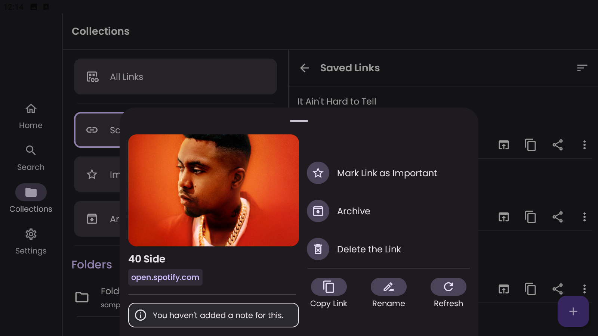

**Linkora** is the ultimate tool for organizing links on Android or on desktop. Whether you need to
save a quick link or manage them in detailed folders, Linkora gets it done.

This repository is part of the  project. It has been
completely rewritten from
scratch, based on the original Linkora App. The original app is available in
the  of
this project. It was Android-specific and was in development until the last three months.

However, the original codebase was tightly coupled. It also lacked the flexibility to extend
features. As a result, I had to step back, rethink everything, and start from
scratch.

This is why this repository is based on KMP (Kotlin Multiplatform). Soon, this codebase will be
moved to the main repository, and development will continue there. Until then, development will
carry on in this repository.

Now, due to this rewrite, Linkora is also built for large screens like Android tablets. Some of the
core features, such as the UI for panels, Menu Bottom Sheet, Dialog Box for adding links,
Import/Export Progress screens, and a few others, have been redesigned in the most UX-friendly way
possible.

This rewrite also provided a new opportunity to build a data-syncing mechanism with
the . The
server can be self-hosted.

---

This repository contains the code for the app itself, which targets both Android and desktop. The
server, which is also part of this project, is based on Ktor. It can be self-hosted and is used for
data syncing across any devices. The server code can be
found .

Linkora and any other client based on Linkora are supported across devices using this server for
syncing. However, each app comes with its own local database. So, excluding the sync functionality,
everything will work just fine if you don’t want to host the server. Updates related to the server
can be found in its repository.

---

The general public release of both the app and server will be available soon.

---

## Features

- Save and organize links with ease.
- Categorize links into folders and subfolders.
- Highlight important links for quick access.
- Archive old links to keep things tidy.
- Customize link names to your preference.
- Share directly from other apps (Android-specific feature).
- Sort and search links and folders quickly.
- Import and export data easily.
- Auto-recognize link images and titles.
- Add folders to your **_Panels_** for instant home screen access.
- Localization supported via a central localization server, also written in Ktor. The server code
  can be found here.

## Screenshots

### Tablet/Desktop Screenshots

|                    |                    |
|--------------------|--------------------|
|  |  |
|  |  |
|  |                    |

### Mobile Screenshots

|                    |                    |                    |                    |
|--------------------|--------------------|--------------------|--------------------|
|  |  |  |  |
|  |  |  |  |

|                         Sharing links from other apps     (Android-specific)                          |
|:-----------------------------------------------------------------------------------------------------:|
| <video src="https://github.com/user-attachments/assets/65fdbdb9-83da-4d83-9dd9-2fa3e3504bc0"></video> |

## Tech Stack

- **Kotlin**: Built entirely in Kotlin.
- **Jetpack Compose with KMP**: Fully Compose-based UI based on KMP.
- **Material 3**: Modern Material Design components.
- **Room**: Efficient local storage solution.
- **Kotlin Coroutines**: Smooth background processing.
- **Kotlin Flows**: For handling asynchronous data streams.
- **Kotlin Channels**: For real-time updates when communicating with different platforms from shared
  code and in some other cases for UI events.
- **Kotlinx Serialization**: For server and vxTwitter API response handling.
- **jsoup**: Custom implementation for importing HTML was easier as jsoup was integrated to scrape
  HTML metadata and import HTML-based files. jsoup is also used for remote website scraping, which
  helps detect titles and images.
- **Coil**: For image loading.
- **Architecture Components**: DataStore, Navigation, and ViewModel.

## Join the Community

Join the Discord for regular updates and discussions related to this project.